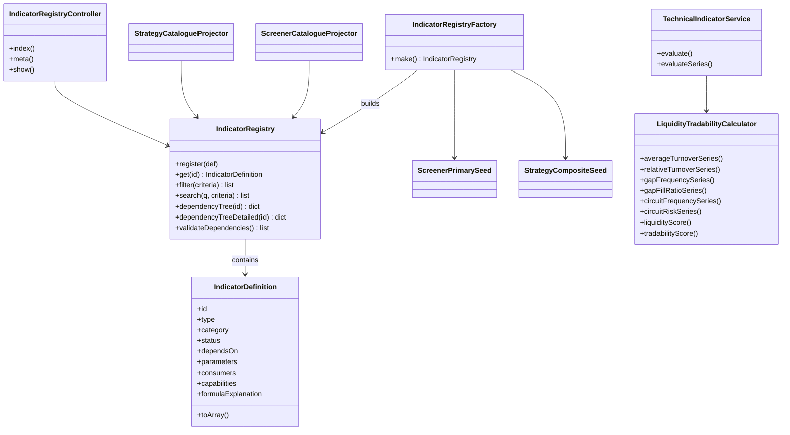
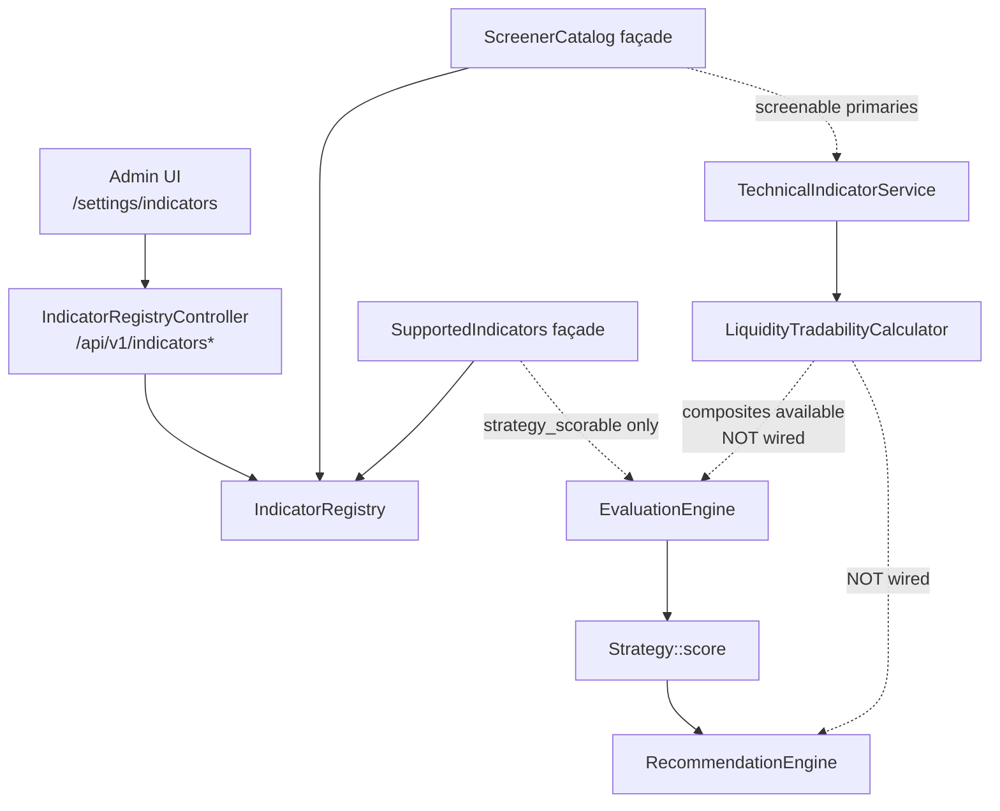
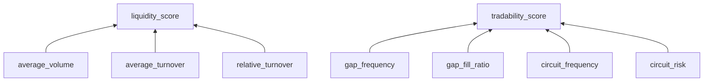
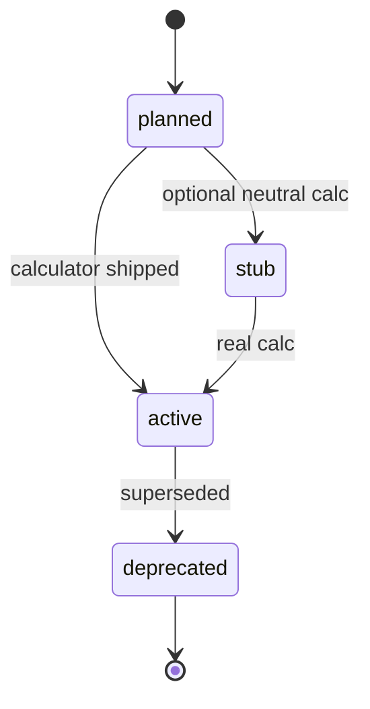

# Indicator Registry — Diagrams (as implemented)

| Field | Value |
|-------|-------|
| **Document** | Indicator Registry diagrams |
| **Version** | 1.0 |
| **Date** | 2026-07-30 |
| **Companion** | [09-Indicator-Registry.md](./09-Indicator-Registry.md) · [13-Indicator-Lifecycle.md](./13-Indicator-Lifecycle.md) |

---

## 1. Class diagram (core)



---

## 2. Component diagram



---

## 3. Registry / consumer diagram

```text
                    ┌─────────────────────────────┐
                    │     Indicator Registry      │
                    │  metadata · deps · version  │
                    └──────────────┬──────────────┘
           ┌───────────────┬───────┼────────┬─────────────┐
           ▼               ▼       ▼        ▼             ▼
      Screener        Discovery  Dashboard  Stock      Admin UI
   (screenable        (tagged    (tagged    Details    (read-only)
    primaries)         future)    future)   (tagged)
           │
           ▼
   TechnicalIndicatorService
           │
           └── LiquidityTradabilityCalculator

Strategy / Evaluation / Recommendation
  ← only existing strategy_scorable composites
  ← Liquidity/Tradability composites EXCLUDED
```

---

## 4. Dependency graph (Liquidity / Tradability)



---

## 5. Indicator lifecycle (simplified)


